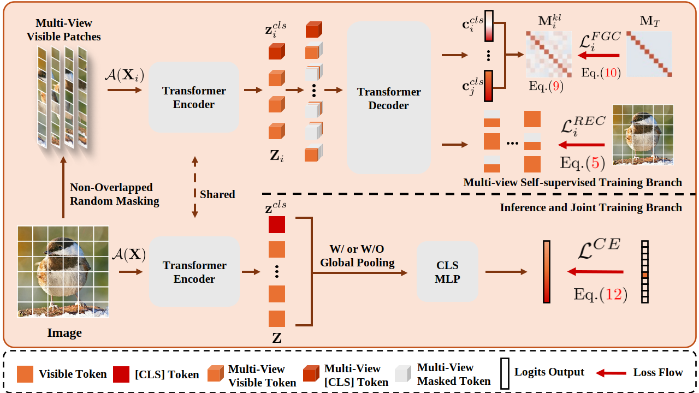

# A Study of Self-Supervised Auxiliary Task by Masked Autoencoders on Small Datasets
This is the official codebase for our paper "A Study of Self-Supervised Auxiliary Task by Masked Autoencoders on Small Datasets" submitted at ICIC 2025.




## Installation

Create the conda environment and install the necessary packages:

```
conda env create -f environment.yml -n FGCR
```

or alternatively

```
conda create -n FGCR python>=3.8
pip install -r requirements.txt -f https://download.pytorch.org/whl/torch_stable.html
```

## Data preparation

We provide code for training on ImageNet-1K, CIFAR10, CIFAR100, SVHN, [Flowers102](https://www.robots.ox.ac.uk/~vgg/data/flowers/102/), [DomainNet](https://ai.bu.edu/M3SDA), [ChaoYang](https://bupt-ai-cz.github.io/HSA-NRL), PMNIST([PneumoniaMNIST](https://medmnist.com/)). CIFAR10, CIFAR100 and SVHN will be automatically downloaded using torchvision, others must be downloaded separately. 

Download and extract ImageNet train and val images from http://image-net.org/.
The directory structure is the standard layout for the torchvision [`datasets.ImageFolder`](https://pytorch.org/docs/stable/torchvision/datasets.html#imagefolder), and the training and validation data is expected to be in the `train/` folder and `val/` folder respectively:

```
/path/to/imagenet/
  train/
    class1/
      img1.jpeg
    class2/
      img2.jpeg
  val/
    class1/
      img3.jpeg
    class2/
      img4.jpeg
```

## Pretrained model weights and fine-tuning
We provide a decoder pre trained weight (MAE) with 128 dimensions, depth of 2, and attention head of 16 on ImageNet with 100 epochs. FGCR is the best weight we presented in our paper.

| Model                                                                                                      | Pretraining Dataset | Fine-tuning Command                                                                                  |
|------------------------------------------------------------------------------------------------------------|--------------------|------------------------------------------------------------------------------------------------------|
| MAE(ViT-T) ([weights](https://drive.google.com/file/d/110dooY8dOzStyQcrquWxigi0_s4lfh5r/view?usp=sharing)) | ImageNet-1k  | `python main_scratch.py -u --data_path imagenet --resume mae_vit_tiny.pth`                 |
| MAE(ViT-S) ([weights](https://drive.google.com/file/d/1QRH6PPBr0lOxdfBB3m2JfWaFNK1JfXvR/view?usp=sharing)) | ImageNet-1k  | `python main_scratch.py -u --data_path imagenet --resume mae_vit_small.pth`                |
| FGCR(ViT-T)                                                                                                | ImageNet-1k    | `python main_two_branch.py -u --views 3 --data_path flowers102 --resume mae_vit_tiny.pth`  |
| FGCR(ViT-S)                                                                                                | ImageNet-1k    | `python main_two_branch.py -u --views 3 --data_path flowers102 --resume mae_vit_small.pth` |

## Evaluation models

| Model                                                                                                                           | Training Dataset           | Training Times | Evaluation Command                                                                                      |
|---------------------------------------------------------------------------------------------------------------------------------|----------------------------|----------------|---------------------------------------------------------------------------------------------------------|
| ViT-T (MAE) ([weights](https://drive.google.com/file/d/1wH1g47g0_GNLL2DYNdkoqrpsq7isVULG/view?usp=sharing))                     | ImageNet-1k (SSL+FT)       | &times;2       | `python main_scratch.py --data_path imagenet --resume mae_vit_tiny_ft.pth --eval --model vit_tiny`   |
| ViT-T (FGCR) ([weights](https://drive.google.com/file/d/13fNvXgV7k8rOxTI6i-PaI5rMNQ76Q1_0/view?usp=sharing))                    | ImageNet-1k (from Scratch) | &times;1.75    | `python main_two_branch.py --data_path imagenet --resume fgcr_vit_tiny.pth --eval --model mae_vit_tiny`             |


## Training models from scratch
To train ViT-Tiny with Self-Supervised Auxiliary Task on ImageNet-1k using 8 GPUs run the following command:
```
CUDA_VISIBLE_DEVICES=0,1,2,3,4,5,6,7 python -m torch.distributed.launch --nproc_per_node=8 main_two_branch.py --data_path imagenet --version FGCR --epochs 100 --model mae_vit_tiny
```
To train ViT-Tiny with Self-Supervised Auxiliary Task on ImageNet-1k using single GPU run the following command:
```
CUDA_VISIBLE_DEVICES=0
python -u main_two_branch.py \
--data_path imagenet \
--nb_classes 1000 \
--model mae_vit_tiny \
--views 3 \
--version FGCR \
--epochs 100 
```
To train ViT-Tiny from scratch on ImageNet-1k using single GPU run the following command:
```
CUDA_VISIBLE_DEVICES=0
python -u main_scratch.py \
--data_path imagenet \
--nb_classes 1000 \
--model vit_tiny \
--version scratch \
--epochs 100 
```


Available arguments for `--data_path` are `/path/to/imagenet`, `c10`, `c100`,`flowers102`, `svhn`, `domainnet`, `chaoyang`, `pmnist`. Other datasets can be added in `datas/datasets.py`.

Available arguments for `--model` are `mae_vit_tiny`, `mae_vit_small`, `mae_vit_base`, `mae_vit_large`, `mae_vit_huge`.


This repository is built on top of the [code](https://github.com/dominickrei/Limited-data-vits) for the paper [Limited Data, Unlimited Potential: A Study on ViTs Augmented by Masked Autoencoders](https://arxiv.org/abs/2310.20704), and the [code](https://github.com/facebookresearch/mae) for the paper [Masked Autoencoders Are Scalable Vision Learners](https://arxiv.org/abs/2111.06377) from Meta Research.
